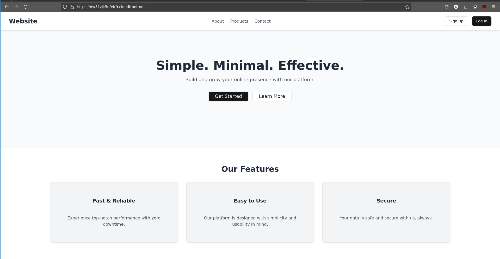
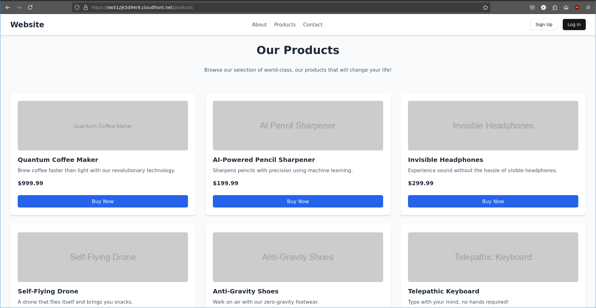

# AWS Frontend Project

This project showcases a **landing page**, **about page**, **product listing page**, and **contact information**, designed for deployment on **AWS S3** and **CloudFront**. It demonstrates responsive design and modern frontend development practices using Vite and Tailwind CSS, along with ShadCN components for UI consistency.## Screenshots

## Screenshots






## Prerequisites

Ensure you have the following installed on your system:

- [git](https://git-scm.com/downloads)  
- [Node.js](https://nodejs.org/) (version 18+)
- [npm](https://www.npmjs.com/) or [yarn](https://yarnpkg.com/)

## Local Setup

Follow these steps to set up the project locally:

1.  Clone the repository:
	```
	git clone https://github.com/kundusubrata/aws-frontend.git
	cd aws-frontend
	```
2. Install dependencies & Start the development server:
	```
	npm install
	npm run dev
	```
	This will start the development server at `http://localhost:5173`.
	
